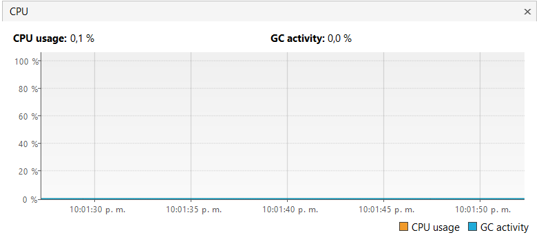
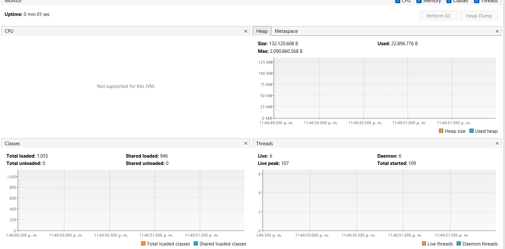
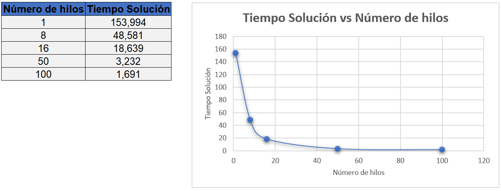

### Escuela Colombiana de Ingeniería
### Arquitecturas de Software - ARSW
### Desarrollado por: Jaider Arley Gonzalez Arias y Miguel Angel Barrera Diaz
## Ejercicio Introducción al paralelismo - Hilos - Caso BlackListSearch

### Dependencias:
####   Lecturas:
*  [Threads in Java](http://beginnersbook.com/2013/03/java-threads/)  (Hasta 'Ending Threads')
*  [Threads vs Processes]( http://cs-fundamentals.com/tech-interview/java/differences-between-thread-and-process-in-java.php)

### Descripción
  Este ejercicio contiene una introducción a la programación con hilos en Java, además de la aplicación a un caso concreto.
  

**Parte I - Introducción a Hilos en Java**

1. De acuerdo con lo revisado en las lecturas, complete las clases CountThread, para que las mismas definan el ciclo de vida de un hilo que imprima por pantalla los números entre A y B.
2. Complete el método __main__ de la clase CountMainThreads para que:
	1. Cree 3 hilos de tipo CountThread, asignándole al primero el intervalo [0..99], al segundo [99..199], y al tercero [200..299].
	2. Inicie los tres hilos con 'start()'.
	3. Ejecute y revise la salida por pantalla. 
	4. Cambie el incio con 'start()' por 'run()'. Cómo cambia la salida?, por qué?.
	
	&emsp;&emsp;&emsp;<b>Respuesta:</b>

	
	&emsp;&emsp;&emsp;Start 

	&emsp;&emsp;&emsp;

	&emsp;&emsp;&emsp;Run

	&emsp;&emsp;&emsp;
	
Cuando se invoca directamente el método "run()" el código se ejecutará en el hilo actual de manera sincrónica, no se creará un nuevo hilo para la ejecución. Usarlo directamente no habilitará la concurrencia y no aprovechará la capacidad de ejecución paralela de threads.  Al usar "start()", en cambio, crea un nuevo thread y ejecuta "run()" en ese nuevo thread, permitiendo la concurrencia y la ejecución paralela.
	

**Parte II - Ejercicio Black List Search**

Para un software de vigilancia automática de seguridad informática se está desarrollando un componente encargado de validar las direcciones IP en varios miles de listas negras (de host maliciosos) conocidas, y reportar aquellas que existan en al menos cinco de dichas listas. 

Dicho componente está diseñado de acuerdo con el siguiente diagrama, donde:

- HostBlackListsDataSourceFacade es una clase que ofrece una 'fachada' para realizar consultas en cualquiera de las N listas negras registradas (método 'isInBlacklistServer'), y que permite también hacer un reporte a una base de datos local de cuando una dirección IP se considera peligrosa. Esta clase NO ES MODIFICABLE, pero se sabe que es 'Thread-Safe'.

- HostBlackListsValidator es una clase que ofrece el método 'checkHost', el cual, a través de la clase 'HostBlackListDataSourceFacade', valida en cada una de las listas negras un host determinado. En dicho método está considerada la política de que al encontrarse un HOST en al menos cinco listas negras, el mismo será registrado como 'no confiable', o como 'confiable' en caso contrario. Adicionalmente, retornará la lista de los números de las 'listas negras' en donde se encontró registrado el HOST.

Al usarse el módulo, la evidencia de que se hizo el registro como 'confiable' o 'no confiable' se dá por lo mensajes de LOGs:

INFO: HOST 205.24.34.55 Reported as trustworthy

INFO: HOST 205.24.34.55 Reported as NOT trustworthy

Al programa de prueba provisto (Main), le toma sólo algunos segundos análizar y reportar la dirección provista (200.24.34.55), ya que la misma está registrada más de cinco veces en los primeros servidores, por lo que no requiere recorrerlos todos. Sin embargo, hacer la búsqueda en casos donde NO hay reportes, o donde los mismos están dispersos en las miles de listas negras, toma bastante tiempo.

Éste, como cualquier método de búsqueda, puede verse como un problema [vergonzosamente paralelo](https://en.wikipedia.org/wiki/Embarrassingly_parallel), ya que no existen dependencias entre una partición del problema y otra.

Para 'refactorizar' este código, y hacer que explote la capacidad multi-núcleo de la CPU del equipo, realice lo siguiente:

1. Cree una clase de tipo Thread que represente el ciclo de vida de un hilo que haga la búsqueda de un segmento del conjunto de servidores disponibles. Agregue a dicha clase un método que permita 'preguntarle' a las instancias del mismo (los hilos) cuantas ocurrencias de servidores maliciosos ha encontrado o encontró.

2. Agregue al método 'checkHost' un parámetro entero N, correspondiente al número de hilos entre los que se va a realizar la búsqueda (recuerde tener en cuenta si N es par o impar!). Modifique el código de este método para que divida el espacio de búsqueda entre las N partes indicadas, y paralelice la búsqueda a través de N hilos. Haga que dicha función espere hasta que los N hilos terminen de resolver su respectivo sub-problema, agregue las ocurrencias encontradas por cada hilo a la lista que retorna el método, y entonces calcule (sumando el total de ocurrencuas encontradas por cada hilo) si el número de ocurrencias es mayor o igual a _BLACK_LIST_ALARM_COUNT_. Si se da este caso, al final se DEBE reportar el host como confiable o no confiable, y mostrar el listado con los números de las listas negras respectivas. Para lograr este comportamiento de 'espera' revise el método [join](https://docs.oracle.com/javase/tutorial/essential/concurrency/join.html) del API de concurrencia de Java. Tenga también en cuenta:

	* Dentro del método checkHost Se debe mantener el LOG que informa, antes de retornar el resultado, el número de listas negras revisadas VS. el número de listas negras total (línea 60). Se debe garantizar que dicha información sea verídica bajo el nuevo esquema de procesamiento en paralelo planteado.

	* Se sabe que el HOST 202.24.34.55 está reportado en listas negras de una forma más dispersa, y que el host 212.24.24.55 NO está en ninguna lista negra.

**Parte II.I Para discutir la próxima clase (NO para implementar aún)**

La estrategia de paralelismo antes implementada es ineficiente en ciertos casos, pues la búsqueda se sigue realizando aún cuando los N hilos (en su conjunto) ya hayan encontrado el número mínimo de ocurrencias requeridas para reportar al servidor como malicioso. Cómo se podría modificar la implementación para minimizar el número de consultas en estos casos?, qué elemento nuevo traería esto al problema?

<b>Respuesta:</b>

Se podría buscar la manera de detener los hilos cuando uno ya consiguió el objetivo. Para esto se podría recurrir a funciones o métodos como:

* Thread.stop(): Detiene bruscamente el hilo, pero esto mismo puede dejar recursos en un estado incierto y potencialmente causar problemas en la aplicación.

* Thread.interrupt(): Este método establece una bandera de interrupción en el hilo. El hilo debe ser programado para revisar periódicamente si se ha establecido la bandera de interrupción y, si es así, detenerse de manera adecuada. Esto implica una cooperación voluntaria del hilo para detenerse.

* Usar una bandera para la terminación: Puedes usar una variable booleana (una "bandera") que los hilos revisen periódicamente. Cuando quieras detener los hilos, cambias el valor de la bandera y los hilos pueden finalizar de manera controlada.

**Parte III - Evaluación de Desempeño**

A partir de lo anterior, implemente la siguiente secuencia de experimentos para realizar las validación de direcciones IP dispersas (por ejemplo 202.24.34.55), tomando los tiempos de ejecución de los mismos (asegúrese de hacerlos en la misma máquina) Al iniciar el programa ejecute el monitor jVisualVM, y a medida que corran las pruebas, revise y anote el consumo de CPU y de memoria en cada caso. 

1. Un solo hilo.

	<b>CPU:</b> 
	<b>Tiempo:</b> 
	
2. Tantos hilos como núcleos de procesamiento (haga que el programa determine esto haciendo uso del [API Runtime](https://docs.oracle.com/javase/7/docs/api/java/lang/Runtime.html)).
	
	<b>CPU:</b> 
	<b>Tiempo:</b> 
3. Tantos hilos como el doble de núcleos de procesamiento.
	
	<b>CPU:</b> 
	<b>Tiempo:</b> 
4. 50 hilos.
	
	<b>CPU:</b> 
	<b>Tiempo:</b> 
5. 100 hilos.
	
	<b>CPU:</b> 
	<b>Tiempo:</b> 

Con lo anterior, y con los tiempos de ejecución dados, haga una gráfica de tiempo de solución vs. número de hilos. Analice y plantee hipótesis con su compañero para las siguientes preguntas (puede tener en cuenta lo reportado por jVisualVM):

Hasta cierto la relación entre el tiempo de solución y el número de hilos es inversamente proporcional, sin embargo, si se sigue con el experimento aumentando el número de hilos se perderá el rendimiento de la aplicación. Es el algoritmo el que decide la mejora de velocidad, no el número de procesadores. Se llega a un momento en el que no se puede paralelizar más el algoritmo.

**Parte IV - Ejercicio Black List Search**

1. Según la [ley de Amdahls](https://www.pugetsystems.com/labs/articles/Estimating-CPU-Performance-using-Amdahls-Law-619/#WhatisAmdahlsLaw?):

	, donde _S(n)_ es el mejoramiento teórico del desempeño, _P_ la fracción paralelizable del algoritmo, y _n_ el número de hilos, a mayor _n_, mayor debería ser dicha mejora. Por qué el mejor desempeño no se logra con los 500 hilos?, cómo se compara este desempeño cuando se usan 200?. 
	
	<b>Respuesta:</b>
	
	Hay que considerar que dado a que P es la fracción paralelizable, a mayor P, mayor es la cantidad de trabajo que puede ser paralelizado y, por lo tanto, mayor es el potencial de mejora al utilizar más hilos.
	Sin embargo el mejor desempeño no se logra con 500 hilos ya que a medida que aumenta el número de hilos, se puede llegar a un punto en el que el hardware no puede manejar tantos hilos de manera eficiente. Puede haber cuellos de botella en la arquitectura del procesador, en la memoria compartida, etc. Además, con demasiados hilos, el overhead de crear, manejar y coordinar los hilos puede superar los beneficios de la paralelización. Esto puede llevar a una disminución del rendimiento en lugar de un aumento. Incluso si la fracción paralelizable (P) es alta, si hay partes del algoritmo que no pueden ser paralelizadas, la Ley de Amdahl establece que hay un límite para el aumento de rendimiento incluso con más hilos.
	
	Para este ejercicio se toma un aproximado de la fracción paralelizable como <b>P=9/35</b>
	
	La recta horizontal verde representa la máxima aceleración o ganancia en velocidad a la cual se podría aproximar el sistema completo debido a la mejora de uno de sus subsistemas. 
	
	Existe un punto en el que ya no vale la pena seguir aumentando la cantidad de hilos porque la diferencia será mínima y en contraste se perderá el rendimiento de la aplicación.

2. Cómo se comporta la solución usando tantos hilos de procesamiento como núcleos comparado con el resultado de usar el doble de éste?.

	<b>Respuesta</b>
	Si se usan tantos hilos de procesamiento como núcleos de CPU disponibles, se podría estar aprovechando eficientemente el hardware disponible para la ejecución en paralelo. En este caso, cada núcleo de CPU se le asignaría a un hilo y podrían trabajar en paralelo sin competir por recursos de procesamiento.
	Ahora, si se hace el uso del doble de hilos (es decir, el doble de núcleos), entonces, en teoría, teniendo suficiente paralelismo en el algoritmo y recursos de hardware, se podría acelerar el proceso aún más. Sin embargo, hay límites prácticos en cuanto a cómo los núcleos de CPU pueden cooperar y coordinarse de manera efectiva.
	En nuestro caso sí se notó una mejora significativa y aún contábamos con la capacidad de aumentar la cantidad de hilos para mejorar la velocidad de respuesta.
3. De acuerdo con lo anterior, si para este problema en lugar de 100 hilos en una sola CPU se pudiera usar 1 hilo en cada una de 100 máquinas hipotéticas, la ley de Amdahls se aplicaría mejor?. Si en lugar de esto se usaran c hilos en 100/c máquinas distribuidas (siendo c es el número de núcleos de dichas máquinas), se mejoraría?. Explique su respuesta.

	<b>Respuesta</b>

	<b>1 Hilo en Cada una de las 100 Máquinas Hipotéticas:</b>

	En este caso, cada máquina tendría su propio hilo y estaría trabajando de manera independiente. Si el problema es altamente paralelizable y no hay dependencias entre las tareas, esta distribución podría ser muy eficiente. La Ley de Amdahl podría aplicarse mejor en este escenario, ya que el factor de mejora (P) sería alto debido a que cada máquina estaría ejecutando tareas independientes en paralelo.

	<b>C Hilos en 100/C Máquinas Distribuidas:</b>
	
	En este caso, estás distribuyendo los hilos en grupos de c hilos en cada una de las máquinas, donde c es el número de núcleos de cada máquina. Esto se llama paralelización híbrida. Aquí es importante considerar cómo se dividen las tareas entre los hilos y cómo se coordina la comunicación entre las máquinas. Si la carga de trabajo es altamente paralelizable y se pueden dividir las tareas de manera eficiente entre los hilos y las máquinas, es posible lograr una mejora significativa en el rendimiento. Sin embargo, la eficiencia de esta distribución dependerá de cómo se gestionen las comunicaciones y posibles cuellos de botella entre las máquinas.

	Tanto la distribución de 1 hilo en cada una de las 100 máquinas hipotéticas como la distribución de c hilos en 100/c máquinas distribuidas pueden mejorar el rendimiento si se hace de manera eficiente en un problema altamente paralelizable. La clave está en cómo se gestionan las tareas, las comunicaciones y los posibles cuellos de botella. En ambos casos, la Ley de Amdahl seguirá aplicando para limitar la mejora teórica del desempeño según la porción no paralelizable del problema.

